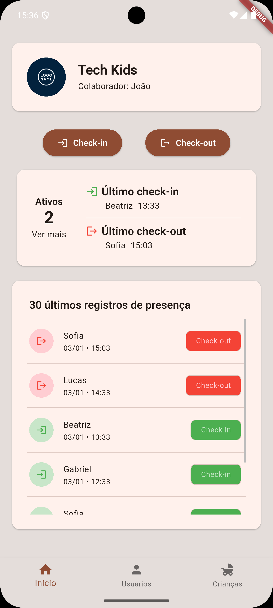
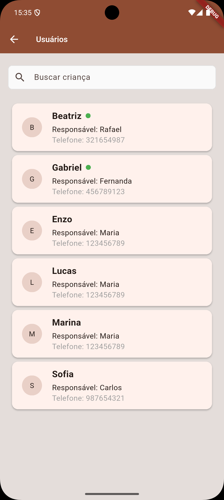
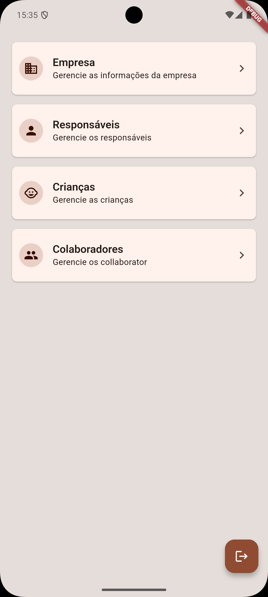
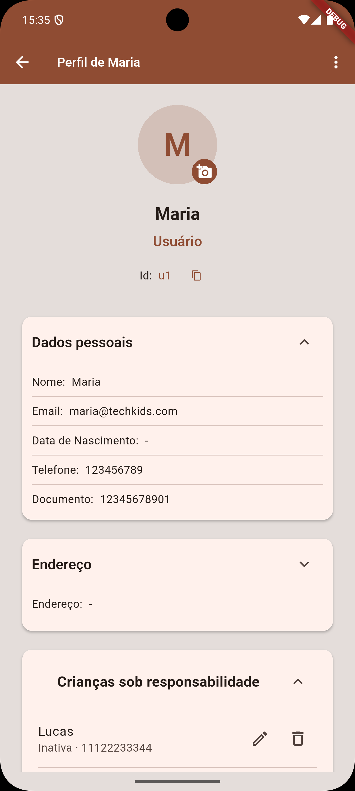

# Kids Space

[](LICENSE)

Despreocupando a vida dos pais: sistema de check-in/check-out para espaços kids.

**Descrição:** Aplicativo mobile Flutter para controle de presença de crianças em
espaços infantis, com login para colaboradores e administradores, gerenciamento
de usuários e crianças como dependentes, edição/remoção, e log de check-ins/
check-outs.

---

## Principais funcionalidades
- **Login** para colaboradores e administradores
- **Gerenciamento de usuários**: adicionar, editar, remover responsáveis
- **Gerenciamento de crianças**: adicionar como dependentes, editar, remover
- **Check-in / Check-out** com histórico (logs)
- **Visão de crianças ativas** e painel administrativo
- **Internacionalização** (`pt-BR`, `en-US`)

## Tecnologias
- Flutter & Dart (ver `pubspec.yaml`)
- State management: MobX
- Dependency Injection: GetIt
- Localização: `easy_localization`

## Arquitetura e pontos importantes
- Estrutura em camadas: `view/`, `controller/`, `model/`, `service/`, `util/`
- Controllers MobX com geração de código (observe `*.g.dart` gerados)
- Injeção via [lib/util/getit_factory.dart](lib/util/getit_factory.dart)
- Entrada do app: [lib/main.dart](lib/main.dart)

## Como rodar (desenvolvimento)

### Pré-requisitos
- Flutter >= 3.8
- SDK Dart compatível (definido em `pubspec.yaml`)

### Passos

```bash
# instalar dependências
flutter pub get

# gerar código MobX (se editar stores)
flutter pub run build_runner build --delete-conflicting-outputs

# rodar no dispositivo/emulador
flutter run
```

## Localização
- Textos traduzidos em `assets/langs/` (`pt-BR.json`, `en-US.json`). A
aplicação inicializa com `pt-BR` como fallback. Veja [lib/main.dart](lib/main.dart) para
configuração.

## Capturas de tela
As capturas adicionadas estão em `assets/screenshots/` — visual abaixo:

<table>
	<tr>
		<td style="padding:8px;vertical-align:top;text-align:center">
			<figure style="margin:0">
				<a href="assets/screenshots/Screenshot_Home_Screen.png"></a>
				<figcaption style="font-size:13px;margin-top:6px">Tela inicial — visão geral e status</figcaption>
			</figure>
		</td>
		<td style="padding:8px;vertical-align:top;text-align:center">
			<figure style="margin:0">
				<a href="assets/screenshots/Screenshot_Childrens_Screen.png"></a>
				<figcaption style="font-size:13px;margin-top:6px">Lista de crianças — adicionar/editar dependentes</figcaption>
			</figure>
		</td>
	</tr>
	<tr>
		<td style="padding:8px;vertical-align:top;text-align:center">
			<figure style="margin:0">
				<a href="assets/screenshots/Screenshot_Admin_Panel.png"></a>
				<figcaption style="font-size:13px;margin-top:6px">Painel administrativo — controles e relatórios</figcaption>
			</figure>
		</td>
		<td style="padding:8px;vertical-align:top;text-align:center">
			<figure style="margin:0">
				<a href="assets/screenshots/Screenshot_Profile_Screen.png"></a>
				<figcaption style="font-size:13px;margin-top:6px">Perfil — dados do responsável/colaborador</figcaption>
			</figure>
		</td>
	</tr>
</table>

## Recursos e imagens
- Assets como imagens e ícones estão em `assets/images/` e `assets/langs/`.

## Licença
- Este projeto está licenciado sob a licença MIT — veja o arquivo [LICENSE](LICENSE) para detalhes.